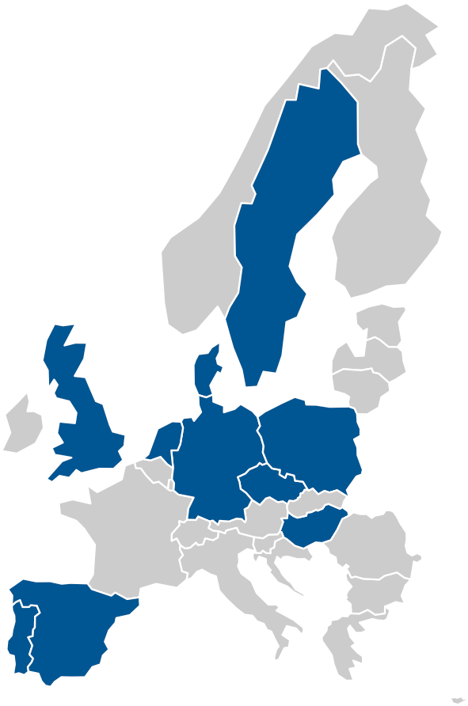

# Comparative Campaign Dynamics Project Data Transformation

## Description

The [Comparative Campaign Dynamics Project](https://www.mzes.uni-mannheim.de/d7/en/datasets/comparative-campaign-dynamics-dataset) offers an amazing data set about the statements political parties make about themselves (*subject statements*) and other parties (*other statements*) during election campaigns (Classified as the one month period before an election except for Portugal where it is the two weeks period). The data set includes campaign statements by parties in two elections each in ten European countries. Coded are all election-relevant statements that were reported in the largest left-leaning and right-leaning daily broadsheet newspapers in a country. 

The CCDP provides data sets on its website that has newspaper articles about political parties as the unit of observation. Since the unit of analysis in social science research is rarely a newspaper article the data needs to be recoded for most projects. In this repository I provide code that cleans and transforms the data that the CCDP makes publicly available on its website to allow for social science analysis of party issue or valence discussions during election campaigns. I also add the widely used party identifier codes from the Comparative Manifesto Project so researchers can easily integrate ideological positions and election results for their analysis. Feel free to use the R script and processed data for your academic research. Issues in the code or data set can be reported through the GitHub page. 

**If you use the data set please add the following data citation to your manuscript:**

*Debus, Marc, Zeynep Somer-Topcu, and Margit Tavits. 2018. Comparative Campaign Dynamics Dataset. Mannheim: Mannheim Centre for European Social Research, University of Mannheim.*

## Content
1. The [ccd_crosswalk.csv](./data_raw/ccd_crosswalk.csv) file in the ``data_raw`` folder matches the Comparative Campaign Dynamics Project (CCDP) party identifier codes with the more widely used party identifier codes from the Comparative Manifesto Project (CMP). Researchers can use the CMP to extend the data set with ideological positions, election results, seat shares and more. 
2. The [ccdp_transformation.R](./scripts/ccdp_transformation.R) script in the ``scripts`` folder downloads the CCDP data and transforms it into three data sets that have parties in elections as the unit of observation. The script is annotated and each transformation is explained. Cleaning and coding are conducted such that they should be straightforward to understand and the R script works as a codebook. 
3. The ``data_processed`` folder holds three csv's that count the issue statements, issue-direction statements, issue-valence statements, and valence statements of political parties in elections. The [self_statements.csv](./data_processed/self_statements.csv) includes counts of all statements a political party made about itself. The [other_statements.csv](./data_processed/other_statements.csv) includes all statements a party made about and received from other political parties. The [combined_statements.csv](./data_processed/combined_statements.csv) combines the self_statements.csv and the other_statements.csv. The R script also includes code that will generate Stata 13 .dta files that can be uncommented and used.

## Variables in the data sets
The self data set and other data set hold counts of issue, issue direction, issue valence, and valence statements of political parties. The [CCDP codebook](http://www.mzes.uni-mannheim.de/publications/wp/wp-167.pdf) lists the meaning of the numeric issue codes on page 15. The data sets that I am providing use these numeric issue codes. 

**Variables in the self statements data set:**

1. ``self_issue_#`` refers to counts of issue statements a party made about itself during the election. ``#`` refers to the issue code in the CCDP codebook. 
2. ``self_issue_#_direction`` refers to issue statements a party made about itself during an election and includes the direction of that issue statement. As before ``#`` refers to the issue code in the CCDP codebook. ``direction`` refers to the positive (pos), negative (neg), neutral (neu) or contradictory (con) dorection that the statement took. 
3. ``self_issue_val_#_type_direction`` refers to counts of issue-related valence statements a political party made about itself. ``self_issue_val`` indicates that it is a self issue-related valence statement. ``#`` refers to the issue code in the CCDP codebook, ``type`` refers to the type of valence statement [party honesty (phon), party competence (pcom), party unity (puni), leader honesty (lhon), leader competence (lcom), leader character (lcha), and other (other)], and the ``direction`` can be positive (pos), negative (neg), neutral (neu), or contradictory (con) direction.
4. ``self_val_direction`` counts the valence statements a party makes about itself. Parties can not only make valence statementsabout themselves related to issues but also just valence statements about themselves. These are coded as ``self_val_direction`` variables. ``self_val_`` refers to all statements by a party about its own nonissue related valence and ``direction`` is the direction of that statement, which can be positive (pos), negative (neg), or neutral.

**Variables in the other statements data set:**

The self statement data set includes only statements political parties made about themselves. The other statements data set includes all statements political parties a) made about other political parties and b) received from other parties. The variables in this data set are coded identically to the ``self_`` variables explained above. The variables that count the number of statements a political party (the subject) makes about another political parties (other) all start with ``other_``. In addition to that the data set also includes variables that count the statements that the subject received from the other party. These variables are again identically coded as the ``self_`` variables explained above. In order to allow easy identification and subsetting of the data set all of them start with ``rec_other_``.

## Countries, Elections, and Newspapers in the CCDP Data
| Country  |  Elections | Left-leaning Newspaper  | Right-leaning Newspaper  |
|---|---|---|---|
|Czech Republic |2010, 2013 |Právo |Mladá fronta Dnes |
|Denmark |2007, 2011 |Politiken |Jyllands-Posten |
|Germany |2009, 2013 | Süddeutsche Zeitung | Frankfurter Allgemeine |
|Hungary  | 2006, 2010|Népszabadság |Magyar Nemze |
|The Netherlands  | 2010, 2012 |de Volkskrant |De Telegraaf |
|Poland | 2007, 2011 |Gazeta Wyborcza | Rzeczpospolita|
|Portugal | 2009, 2011 | Público| Jornal de Notícias|
|Spain | 2008, 2011  |El País |El Mundo |
|Sweden |2010, 2014 | Dagens Nyheter| Aftonbladet|
|United Kingdom | 2005, 2010, 2015 | The Guardian| The Daily Telegraph |

## External Content
1. [CCDP Data sets](https://www.mzes.uni-mannheim.de/d7/en/datasets/comparative-campaign-dynamics-dataset)
2. [CCDP Codebook](http://www.mzes.uni-mannheim.de/publications/wp/wp-167.pdf)